# 0xAddress Wallet

## Technical Documentation v1.0

<div align="center">


**Self-Custody Ethereum Wallet Extension**

[](https://opensource.org/licenses/MIT)
[](https://chrome.google.com/webstore)
[](https://developer.chrome.com/docs/extensions/mv3/)

[Website](https://0xaddress.com) • [GitHub](https://github.com/stamping/0xaddress/) • [Playground](https://0xaddress.com/dev/)

</div>

---

## 📑 Table of Contents

1. [Introduction](#1-introduction)
2. [System Architecture](#2-system-architecture)
3. [Project Structure](#3-project-structure)
4. [Core Components](#4-core-components)
5. [Data Flows](#5-data-flows)
6. [Security & Cryptography](#6-security--cryptography)
7. [dApp Integration](#7-dapp-integration)
8. [Network Management](#8-network-management)
9. [Storage System](#9-storage-system)
10. [Internationalization](#10-internationalization)
11. [Development Guide](#11-development-guide)
12. [API Reference](#12-api-reference)
13. [Troubleshooting](#13-troubleshooting)

---

## 1. Introduction

### 1.1 Overview

**0xAddress** is a Chrome browser extension that functions as a self-custody Web3 wallet. It enables users to manage their digital assets, connect to decentralized applications (dApps), and sign transactions securely.

### 1.2 Key Features

| Feature | Description |
|---------|-------------|
| **Self-Custody** | Private keys never leave the user's device |
| **Multi-Network** | Support for 20+ EVM networks (Ethereum, Polygon, BSC, etc.) |
| **EIP-1193** | Standard-compliant Ethereum provider |
| **ERC-20 Tokens** | Complete fungible token management |
| **ERC-721 NFTs** | NFT viewing and transfer capabilities |
| **Secure Signing** | Support for personal_sign and EIP-712 |
| **PEM Certificates** | Exportable encrypted backup |

### 1.3 System Requirements

```
Chrome/Chromium >= 88
Manifest Version: 3
Node.js >= 18 (development)
```

### 1.4 Technology Stack


---

## 2. System Architecture

### 2.1 Architecture Overview

The extension follows the Chrome Extensions architecture pattern with Manifest V3, dividing functionality into three isolated contexts that communicate via message passing.

```mermaid
flowchart TB
    subgraph Browser["🌐 Browser"]
        subgraph WebPage["Web Page (dApp)"]
            DAPP[("dApp\n(React, Vue, etc.)")]
            INPAGE["inpage.js\n(window.oxaddress)"]
        end
        
        subgraph Extension["Chrome Extension"]
            CS["content-script.js\n(Bridge)"]
            BG["background.js\n(Service Worker)"]
            POPUP["popup.html\n+ JS modules"]
        end
        
        subgraph Storage["Storage"]
            LS[("localStorage")]
            CS_STORAGE[("chrome.storage")]
        end
    end
    
    DAPP <-->|"window.postMessage"| INPAGE
    INPAGE <-->|"window.postMessage"| CS
    CS <-->|"chrome.runtime.sendMessage"| BG
    BG <-->|"chrome.runtime.sendMessage"| POPUP
    
    POPUP --> LS
    BG --> CS_STORAGE
    
    BG <-->|"JSON-RPC"| RPC[("🔗 RPC Node\n(Blockchain)")]
    
    style DAPP fill:#e1f5fe
    style INPAGE fill:#fff3e0
    style CS fill:#f3e5f5
    style BG fill:#e8f5e9
    style POPUP fill:#fce4ec
```



### 2.2 Execution Contexts

| Context | File(s) | Description | Access |
|---------|---------|-------------|--------|
| **Page Context** | `inpage.js` | Provider injected as `window.oxaddress` | DOM, window |
| **Content Script** | `content-script.js` | Communication bridge | Limited DOM, chrome.runtime |
| **Service Worker** | `background.js` | Core logic and state | chrome.* APIs, fetch |
| **Popup** | `popup.html`, `app.js`, etc. | User interface | Own DOM, chrome.* APIs |

### 2.3 Component Diagram


---

## 3. Project Structure

### 3.1 Directory Tree

```
0xaddress/
├── 📄 manifest.json          # Extension configuration
├── 📄 popup.html             # Main popup HTML
├── 📄 README.md              # Basic documentation
│
├── 📁 js/                    # JavaScript code
│   ├── 📄 app.js             # Main initialization
│   ├── 📄 background.js      # Service Worker
│   ├── 📄 config.js          # Network configuration
│   ├── 📄 content-script.js  # Communication bridge
│   ├── 📄 event-handlers.js  # UI event handlers
│   ├── 📄 i18n.js            # Translation system
│   ├── 📄 inpage.js          # Injected provider
│   ├── 📄 multi-account.js   # Multi-account management
│   ├── 📄 other-contracts.js # Additional contracts
│   ├── 📄 popup-bridge.js    # Request approval
│   ├── 📄 preferences.js     # Preferences panel
│   ├── 📄 ui.js              # UI components
│   └── 📄 wallet.js          # Core wallet logic
│
├── 📁 css/
│   └── 📄 styles.css         # Global styles
│
├── 📁 lib/                   # External libraries
│   ├── 📄 ethers.min.js      # ethers.js v6
│   ├── 📄 crypto-js.min.js   # CryptoJS
│   └── 📄 qrcode.min.js      # QR generator
│
├── 📁 abis/                  # Contract ABIs
│   ├── 📄 erc20.js           # ERC-20 ABI
│   └── 📄 erc721.js          # ERC-721 ABI
│
├── 📁 icons/                 # Extension icons
│   ├── 📄 icon16.png
│   ├── 📄 icon32.png
│   ├── 📄 icon48.png
│   ├── 📄 icon128.png
│   └── 📄 icon.svg
│
└── 📁 demo/                  # Demos and examples
    └── 📄 signature-lab.html
```

### 3.2 Main File Descriptions

| File | Lines | Size | Responsibility |
|------|-------|------|----------------|
| `background.js` | ~900 | 27KB | Global state, RPC, sessions, pending requests |
| `wallet.js` | ~1200 | 49KB | Cryptography, signing, balances, transactions |
| `ui.js` | ~3000 | 104KB | Rendering, modals, lists, forms |
| `popup-bridge.js` | ~1700 | 63KB | Connection/transaction approval |
| `i18n.js` | ~1600 | 69KB | ES/EN translations |
| `app.js` | ~1100 | 44KB | Initialization, navigation, events |
| `config.js` | ~400 | 12KB | Predefined networks, NetworkManager |
| `preferences.js` | ~600 | 24KB | Configuration, overlays, onboarding |
| `inpage.js` | ~270 | 8.5KB | Injected EIP-1193 provider |

---

## 4. Core Components

### 4.1 Background Service Worker (`background.js`)

The Service Worker is the heart of the extension. It maintains global state and processes all RPC requests.

#### 4.1.1 Global State

```javascript
let walletState = {
  isLocked: true,           // Lock state
  address: null,            // Active address
  chainId: '0x23a',         // Chain ID in hex (default: Rollux)
  connectedSites: {},       // Connected sites
  sessionKey: null,         // Private key in memory
  sessionExpiry: null       // Expiration timestamp
};
```

#### 4.1.2 Service Worker Lifecycle


#### 4.1.3 Handled Message Types

| Message Type | Description | Requires Auth |
|--------------|-------------|---------------|
| `GET_STATE` | Get public state | No |
| `RPC_REQUEST` | JSON-RPC request | Variable |
| `POPUP_UNLOCK` | Unlock wallet | Yes |
| `POPUP_LOCK` | Lock wallet | No |
| `POPUP_APPROVE_REQUEST` | Approve request | Yes |
| `POPUP_REJECT_REQUEST` | Reject request | No |
| `POPUP_UPDATE_NETWORK` | Change network | No |
| `POPUP_DISCONNECT_SITE` | Disconnect site | No |
| `POPUP_GET_PENDING` | Get pending requests | No |
| `POPUP_EXECUTE_TX` | Execute transaction | Yes |
| `POPUP_SIGN_MESSAGE` | Sign message | Yes |

### 4.2 Wallet Core (`wallet.js`)

Main class handling all cryptographic and blockchain logic.

#### 4.2.1 Wallet Class Structure


#### 4.2.2 Encryption Methods

```javascript
// PBKDF2 + AES-256-CBC
encryptWithPBKDF2(data, password, iterations = 300000) {
    const salt = CryptoJS.lib.WordArray.random(128 / 8);
    const iv = CryptoJS.lib.WordArray.random(128 / 8);
    const key = CryptoJS.PBKDF2(password, salt, {
        keySize: 256 / 32,
        iterations: iterations,
        hasher: CryptoJS.algo.SHA256
    });
    
    const encrypted = CryptoJS.AES.encrypt(data, key, {
        iv: iv,
        mode: CryptoJS.mode.CBC,
        padding: CryptoJS.pad.Pkcs7
    });
    
    return { ct, iv, salt, iterations };
}
```

### 4.3 Injected Provider (`inpage.js`)

EIP-1193 compatible provider injected as `window.oxaddress`.

#### 4.3.1 Provider Interface


#### 4.3.2 Supported Events

| Event | Description | Payload |
|-------|-------------|---------|
| `connect` | Connection established | `{ chainId: string }` |
| `disconnect` | Connection lost | `{ code: number, message: string }` |
| `chainChanged` | Network changed | `chainId: string` |
| `accountsChanged` | Account changed | `accounts: string[]` |

### 4.4 Content Script (`content-script.js`)

Acts as a bidirectional bridge between the web page and background.


---

## 5. Data Flows

### 5.1 Connection Flow (eth_requestAccounts)


### 5.2 Message Signing Flow (personal_sign)


### 5.3 Transaction Flow (eth_sendTransaction)


### 5.4 Network Switch Flow (wallet_switchEthereumChain)


---

## 6. Security & Cryptography

### 6.1 Security Model


### 6.2 Cryptographic Algorithms

| Purpose | Algorithm | Parameters |
|---------|-----------|------------|
| Key derivation | PBKDF2 | SHA-256, 300,000 iterations |
| Symmetric encryption | AES-256 | CBC mode, PKCS7 padding |
| IV | Random | 128 bits |
| Salt | Random | 128 bits |
| Address hashing | Keccak-256 | Ethereum standard |
| ECDSA signing | secp256k1 | Ethereum standard |

### 6.3 Secure Storage

#### 6.3.1 Encrypted Key Format

```json
{
  "ct": "base64_encoded_ciphertext",
  "iv": "hex_encoded_iv",
  "salt": "hex_encoded_salt",
  "iterations": 300000
}
```

#### 6.3.2 PEM Certificate

```
-----BEGIN OXADDRESS ENCRYPTED WALLET-----
Version: 1.0
Address: 0x1234...abcd
Network: rollux
Timestamp: 2025-01-15T10:30:00Z
Iterations: 300000

eyJjdCI6IkJhc2U2NC4uLiIsIml2IjoiLi4uIiwic2FsdCI6Ii4uLiJ9
-----END OXADDRESS ENCRYPTED WALLET-----
```

### 6.4 Session Management


### 6.5 Security Principles

1. **Private key never on disk unencrypted**
   - Always encrypted with AES-256-CBC
   - Only decrypted in memory during operations

2. **Context isolation**
   - Content script has no access to keys
   - Background only shares public information

3. **Origin validation**
   - Each request includes verifiable `origin`
   - Sites must be explicitly connected

4. **No external dependencies for sensitive cryptography**
   - PBKDF2 and AES via CryptoJS (audited)
   - Signing via ethers.js (industry standard)

---

## 7. dApp Integration

### 7.1 Provider API (EIP-1193)

The provider is exposed as `window.oxaddress` and is compliant with the EIP-1193 standard.

#### 7.1.1 Provider Detection

```javascript
// Detect 0xAddress
if (window.oxaddress) {
    console.log('0xAddress is installed');
    const provider = window.oxaddress;
}

// Multiple detection (0xAddress or MetaMask)
function getProvider() {
    if (window.oxaddress) return window.oxaddress;
    if (window.ethereum) return window.ethereum;
    return null;
}
```

#### 7.1.2 Supported RPC Methods

| Method | Category | Description |
|--------|----------|-------------|
| `eth_requestAccounts` | Connection | Request connection |
| `eth_accounts` | Connection | Get connected accounts |
| `eth_chainId` | Network | Get Chain ID |
| `net_version` | Network | Get network version |
| `personal_sign` | Signing | Sign message |
| `eth_sign` | Signing | Sign hash (legacy) |
| `eth_signTypedData_v4` | Signing | EIP-712 signing |
| `eth_sendTransaction` | Transaction | Send transaction |
| `eth_call` | Read | Call contract function |
| `eth_getBalance` | Read | Get balance |
| `eth_getTransactionReceipt` | Read | Get receipt |
| `eth_blockNumber` | Read | Current block number |
| `eth_gasPrice` | Read | Gas price |
| `eth_estimateGas` | Read | Estimate gas |
| `wallet_switchEthereumChain` | Network | Switch network |
| `wallet_addEthereumChain` | Network | Add new network |

### 7.2 Integration Examples

#### 7.2.1 Basic Connection

```javascript
async function connectWallet() {
    if (!window.oxaddress) {
        alert('Please install 0xAddress');
        return;
    }
    
    try {
        const accounts = await window.oxaddress.request({
            method: 'eth_requestAccounts'
        });
        
        console.log('Connected:', accounts[0]);
        return accounts[0];
    } catch (error) {
        if (error.code === 4001) {
            console.log('User rejected connection');
        }
        throw error;
    }
}
```

#### 7.2.2 Message Signing

```javascript
async function signMessage(message) {
    const accounts = await window.oxaddress.request({
        method: 'eth_accounts'
    });
    
    if (!accounts.length) {
        throw new Error('Not connected');
    }
    
    const signature = await window.oxaddress.request({
        method: 'personal_sign',
        params: [message, accounts[0]]
    });
    
    return signature;
}
```

#### 7.2.3 EIP-712 Signing (Typed Data)

```javascript
async function signPermit(tokenAddress, spender, value, deadline) {
    const accounts = await window.oxaddress.request({
        method: 'eth_accounts'
    });
    
    const chainId = await window.oxaddress.request({
        method: 'eth_chainId'
    });
    
    const typedData = {
        types: {
            EIP712Domain: [
                { name: 'name', type: 'string' },
                { name: 'version', type: 'string' },
                { name: 'chainId', type: 'uint256' },
                { name: 'verifyingContract', type: 'address' }
            ],
            Permit: [
                { name: 'owner', type: 'address' },
                { name: 'spender', type: 'address' },
                { name: 'value', type: 'uint256' },
                { name: 'nonce', type: 'uint256' },
                { name: 'deadline', type: 'uint256' }
            ]
        },
        primaryType: 'Permit',
        domain: {
            name: 'Token Name',
            version: '1',
            chainId: parseInt(chainId, 16),
            verifyingContract: tokenAddress
        },
        message: {
            owner: accounts[0],
            spender: spender,
            value: value,
            nonce: 0,
            deadline: deadline
        }
    };
    
    const signature = await window.oxaddress.request({
        method: 'eth_signTypedData_v4',
        params: [accounts[0], JSON.stringify(typedData)]
    });
    
    return signature;
}
```

#### 7.2.4 Sending Transactions

```javascript
async function sendTransaction(to, valueInEth) {
    const accounts = await window.oxaddress.request({
        method: 'eth_accounts'
    });
    
    const valueWei = '0x' + (BigInt(valueInEth * 1e18)).toString(16);
    
    const txHash = await window.oxaddress.request({
        method: 'eth_sendTransaction',
        params: [{
            from: accounts[0],
            to: to,
            value: valueWei
        }]
    });
    
    return txHash;
}
```

#### 7.2.5 Network Switching

```javascript
async function switchToPolygon() {
    try {
        await window.oxaddress.request({
            method: 'wallet_switchEthereumChain',
            params: [{ chainId: '0x89' }] // 137 in hex
        });
    } catch (error) {
        if (error.code === 4902) {
            // Network doesn't exist, try adding it
            await window.oxaddress.request({
                method: 'wallet_addEthereumChain',
                params: [{
                    chainId: '0x89',
                    chainName: 'Polygon Mainnet',
                    nativeCurrency: {
                        name: 'MATIC',
                        symbol: 'MATIC',
                        decimals: 18
                    },
                    rpcUrls: ['https://polygon-rpc.com'],
                    blockExplorerUrls: ['https://polygonscan.com']
                }]
            });
        }
    }
}
```

#### 7.2.6 Listening to Events

```javascript
// Account change
window.oxaddress.on('accountsChanged', (accounts) => {
    if (accounts.length === 0) {
        console.log('Disconnected');
    } else {
        console.log('New account:', accounts[0]);
    }
});

// Network change
window.oxaddress.on('chainChanged', (chainId) => {
    console.log('New network:', chainId);
    // Recommended: reload page
    window.location.reload();
});

// Connection established
window.oxaddress.on('connect', (info) => {
    console.log('Connected to:', info.chainId);
});

// Disconnection
window.oxaddress.on('disconnect', (error) => {
    console.log('Disconnected:', error.message);
});
```

### 7.3 Development Playground

To test integrations, use the official playground:

**URL**: https://0xaddress.com/dev/

The playground allows:
- Testing all RPC methods
- Viewing JS code examples
- Downloading functional HTML demos
- Generating MetaMask-compatible code

---

## 8. Network Management

### 8.1 Predefined Networks

0xAddress includes native support for the following networks:

| Network | Chain ID | Symbol | Primary RPC |
|---------|----------|--------|-------------|
| Rollux | 570 | SYS | https://rpc.rollux.com |
| Syscoin NEVM | 57 | SYS | https://rpc.syscoin.org |
| Ethereum | 1 | ETH | https://eth.llamarpc.com |
| Polygon | 137 | POL | https://polygon-rpc.com |
| BNB Smart Chain | 56 | BNB | https://bsc-dataseed.binance.org |
| Arbitrum One | 42161 | ETH | https://arb1.arbitrum.io/rpc |
| Optimism | 10 | ETH | https://mainnet.optimism.io |
| Base | 8453 | ETH | https://mainnet.base.org |
| Avalanche | 43114 | AVAX | https://api.avax.network/ext/bc/C/rpc |
| Fantom | 250 | FTM | https://rpc.ftm.tools |
| Cronos | 25 | CRO | https://evm.cronos.org |
| Linea | 59144 | ETH | https://rpc.linea.build |
| zkSync Era | 324 | ETH | https://mainnet.era.zksync.io |
| Mantle | 5000 | MNT | https://rpc.mantle.xyz |
| Celo | 42220 | CELO | https://forno.celo.org |
| Gnosis | 100 | xDAI | https://rpc.gnosischain.com |
| Scroll | 534352 | ETH | https://rpc.scroll.io |
| Blast | 81457 | ETH | https://rpc.blast.io |
| Soneium | 1868 | ETH | https://rpc.soneium.org |
| Sepolia | 11155111 | ETH | https://rpc.sepolia.org |

### 8.2 NetworkManager

The `NetworkManager` (in `config.js`) manages available networks.

```javascript
const NetworkManager = {
    // Get current network
    getCurrentNetwork() {
        const saved = localStorage.getItem('0xaddress_network');
        return this.getNetwork(saved) || NETWORKS.rollux;
    },
    
    // Set active network
    setCurrentNetwork(networkId) {
        const network = this.getNetwork(networkId);
        if (network) {
            localStorage.setItem('0xaddress_network', networkId);
            return network;
        }
        return null;
    },
    
    // Get all networks
    getAllNetworks() {
        const networks = { ...NETWORKS };
        const custom = this.getCustomNetworks();
        return { ...networks, ...custom };
    },
    
    // Add custom network
    addCustomNetwork(network) {
        const customNetworks = this.getCustomNetworks();
        const id = `custom_${network.chainId}`;
        customNetworks[id] = { ...network, id, isCustom: true };
        localStorage.setItem('0xaddress_custom_networks', 
            JSON.stringify(customNetworks));
        return id;
    }
};
```

### 8.3 Network Structure

```typescript
interface Network {
    id: string;           // Unique identifier
    name: string;         // Display name
    chainId: number;      // Decimal Chain ID
    rpcUrl: string;       // Primary RPC
    rpcUrlFallback?: string; // Backup RPC
    wsUrl?: string;       // WebSocket URL
    wsUrlFallback?: string;
    explorer: string;     // Explorer URL
    currency: {
        name: string;     // Currency name
        symbol: string;   // Symbol (ETH, BNB, etc.)
        decimals: number; // Decimals (usually 18)
    };
    isDefault?: boolean;  // Default network
    isCustom?: boolean;   // User-added network
}
```

---

## 9. Storage System

### 9.1 Storage Keys

0xAddress uses two storage mechanisms:

#### 9.1.1 localStorage (Popup Data)

| Key | Type | Description |
|-----|------|-------------|
| `0xaddress_encrypted_key` | JSON | Encrypted private key |
| `0xaddress_address` | string | Wallet address |
| `0xaddress_mnemonic` | JSON | Encrypted mnemonic |
| `0xaddress_network` | string | Active network ID |
| `0xaddress_contracts` | JSON | Added tokens |
| `0xaddress_nfts` | JSON | Added NFTs |
| `0xaddress_custom_networks` | JSON | Custom networks |
| `0xaddress_activity` | JSON | Activity history |
| `0xaddress_language` | string | Selected language |
| `0xaddress_session_expiry` | number | Expiration timestamp |
| `0xaddress_session_duration` | number | Session duration (ms) |

#### 9.1.2 chrome.storage.local (Background)

| Key | Type | Description |
|-----|------|-------------|
| `0xaddress_address` | string | Address (synced) |
| `0xaddress_network` | string | Network ID |
| `0xaddress_chainId` | string | Chain ID in hex |
| `0xaddress_connected_sites` | JSON | Connected sites |
| `0xaddress_session_key` | string | Session key |
| `0xaddress_session_expiry` | number | Session expiration |
| `0xaddress_custom_networks` | JSON | Custom networks |

### 9.2 Storage Diagram


---

## 10. Internationalization

### 10.1 i18n System

The `i18n.js` file contains all translations organized by language.

```javascript
const translations = {
    es: {
        // General
        appName: '0xAddress',
        loading: 'Cargando...',
        cancel: 'Cancelar',
        confirm: 'Confirmar',
        // ... more translations
    },
    en: {
        appName: '0xAddress',
        loading: 'Loading...',
        cancel: 'Cancel',
        confirm: 'Confirm',
        // ... more translations
    }
};
```

### 10.2 Using Translations

```javascript
// Translation function
function t(key) {
    const lang = localStorage.getItem('0xaddress_language') || 'es';
    return translations[lang][key] || translations['es'][key] || key;
}

// Usage in code
document.getElementById('title').textContent = t('welcome');

// Usage in HTML with data attributes
<span data-i18n="welcome"></span>

// Apply translations to elements with data-i18n
function applyTranslations() {
    document.querySelectorAll('[data-i18n]').forEach(el => {
        const key = el.getAttribute('data-i18n');
        el.textContent = t(key);
    });
}
```

### 10.3 Supported Languages

| Code | Language | Coverage |
|------|----------|----------|
| `es` | Spanish | 100% |
| `en` | English | 100% |

---

## 11. Development Guide

### 11.1 Environment Setup

```bash
# Clone repository
git clone https://github.com/stamping/0xaddress.git
cd 0xaddress

# No dependency installation required
# Libraries are included in /lib

# Load in Chrome
1. Open chrome://extensions
2. Enable "Developer mode"
3. Click "Load unpacked"
4. Select the project folder
```

### 11.2 Development Structure

```
Local Development
├── Edit JS/CSS/HTML files
├── Reload extension in chrome://extensions
└── Test changes in popup or dApps

Debugging
├── Popup: Right-click → Inspect
├── Background: chrome://extensions → Service Worker
├── Content Script: Page DevTools → Console
└── Inpage: Page DevTools → Console (window.oxaddress)
```

### 11.3 Code Conventions

#### Naming

```javascript
// Variables: camelCase
let userAddress = '0x...';

// Constants: UPPER_SNAKE_CASE
const MAX_RETRIES = 3;

// Classes: PascalCase
class WalletProvider { }

// Functions: camelCase, descriptive verbs
function getUserBalance() { }
async function sendTransaction() { }

// Events: camelCase with 'on' or 'handle' prefix
function onAccountChange() { }
function handleNetworkSwitch() { }
```

#### Function Structure

```javascript
/**
 * Function description
 * @param {string} address - Wallet address
 * @param {number} chainId - Network ID
 * @returns {Promise<string>} Balance in wei
 */
async function getBalance(address, chainId) {
    // Input validation
    if (!ethers.isAddress(address)) {
        throw new Error('Invalid address');
    }
    
    // Main logic
    try {
        const balance = await provider.getBalance(address);
        return balance.toString();
    } catch (error) {
        console.error('Error getting balance:', error);
        throw error;
    }
}
```

### 11.4 Manual Testing

#### Test Checklist

- [ ] Create new wallet
- [ ] Import wallet from mnemonic
- [ ] Import wallet from PEM file
- [ ] Connect to dApp
- [ ] Sign message (personal_sign)
- [ ] Sign typed data (EIP-712)
- [ ] Send transaction
- [ ] Switch network
- [ ] Add custom network
- [ ] Add ERC-20 token
- [ ] View NFTs
- [ ] Export PEM certificate
- [ ] Lock/Unlock wallet
- [ ] Change password
- [ ] Reset wallet

### 11.5 Adding a New Network

```javascript
// In config.js, add to NETWORKS object:
newNetwork: {
    id: 'newNetwork',
    name: 'New Network',
    chainId: 12345,
    rpcUrl: 'https://rpc.newnetwork.com',
    rpcUrlFallback: 'https://backup.newnetwork.com',
    explorer: 'https://explorer.newnetwork.com',
    currency: {
        name: 'Token Name',
        symbol: 'TKN',
        decimals: 18
    }
},

// In background.js, add to getRpcUrl():
12345: 'https://rpc.newnetwork.com',

// In background.js, add to getChainIdHex():
newNetwork: '0x3039',

// In background.js, add to findNetworkByChainId():
12345: 'newNetwork',

// In background.js, add to getNetworkName():
newNetwork: 'New Network',
```

### 11.6 Adding a New Translation

```javascript
// In i18n.js, add the key in both languages:

// Spanish
es: {
    // ... existing translations
    newFeature: 'Nueva característica',
    newFeatureDesc: 'Descripción de la nueva característica',
}

// English
en: {
    // ... existing translations
    newFeature: 'New Feature',
    newFeatureDesc: 'Description of the new feature',
}

// Usage in code:
document.getElementById('feature').textContent = t('newFeature');
```

---

## 12. API Reference

### 12.1 Wallet Class

```typescript
class Wallet {
    // Properties
    provider: ethers.JsonRpcProvider;
    address: string | null;
    nativeBalance: string;
    isInitialized: boolean;
    
    // Initialization
    async init(): Promise<void>;
    
    // Creation and import
    create(password: string): { address: string, mnemonic: string };
    importFromMnemonic(mnemonic: string, password: string): { address: string };
    importFromPrivateKey(privateKey: string, password: string): { address: string };
    importFromPEM(pemContent: string, pemPassword: string, walletPassword: string): { address: string };
    
    // Cryptography
    encryptPrivateKey(privateKey: string, password: string): EncryptedData;
    decryptPrivateKey(password: string): string;
    verifyPassword(password: string): boolean;
    getMnemonic(password: string): string | null;
    
    // Operations
    getSigner(password: string): ethers.Wallet;
    async getBalance(address?: string): Promise<string>;
    async sendTransaction(tx: TransactionRequest, password: string): Promise<string>;
    async signMessage(message: string, password: string): Promise<string>;
    async signTypedData(domain: object, types: object, value: object, password: string): Promise<string>;
    
    // Tokens
    async getTokenBalance(tokenAddress: string, walletAddress: string): Promise<string>;
    async getTokenInfo(tokenAddress: string): Promise<TokenInfo>;
    async transferToken(tokenAddress: string, to: string, amount: string, password: string): Promise<string>;
    
    // State
    hasWallet(): boolean;
    hasMnemonic(): boolean;
    resetWallet(): void;
    
    // Export
    async exportToPEM(password: string, pemPassword: string): Promise<string>;
}

interface EncryptedData {
    ct: string;      // Ciphertext in Base64
    iv: string;      // IV in hex
    salt: string;    // Salt in hex
    iterations: number;
}

interface TokenInfo {
    address: string;
    name: string;
    symbol: string;
    decimals: number;
}
```

### 12.2 Provider (window.oxaddress)

```typescript
interface OxAddressProvider {
    // Properties
    readonly isOxAddress: boolean;
    readonly is0xAddress: boolean;
    readonly isMetaMask: false;
    readonly chainId: string | null;
    readonly selectedAddress: string | null;
    readonly networkVersion: string | null;
    
    // Main method
    request(args: RequestArguments): Promise<unknown>;
    
    // Events
    on(event: string, handler: Function): this;
    off(event: string, handler: Function): this;
    removeAllListeners(event?: string): this;
}

interface RequestArguments {
    method: string;
    params?: unknown[];
}

// Available events
type ProviderEvents = 
    | 'connect'
    | 'disconnect'
    | 'chainChanged'
    | 'accountsChanged';
```

### 12.3 Error Codes

| Code | Name | Description |
|------|------|-------------|
| 4001 | User Rejected | User rejected the request |
| 4100 | Unauthorized | Not connected to site |
| 4200 | Unsupported | Method not supported |
| 4900 | Disconnected | Provider disconnected |
| 4901 | Chain Disconnected | Network disconnected |
| 4902 | Unrecognized Chain | Network not recognized |
| -32600 | Invalid Request | Invalid request |
| -32601 | Method Not Found | Method not found |
| -32602 | Invalid Params | Invalid parameters |
| -32603 | Internal Error | Internal error |
| -32700 | Parse Error | JSON parsing error |

---

## 13. Troubleshooting

### 13.1 Common Issues

#### Provider not detected

```javascript
// Issue: window.oxaddress is undefined

// Solution 1: Wait for injection
window.addEventListener('load', () => {
    setTimeout(() => {
        if (window.oxaddress) {
            // Provider available
        }
    }, 100);
});

// Solution 2: Listen for custom event
window.addEventListener('oxaddress#initialized', () => {
    console.log('0xAddress ready');
});
```

#### Transaction signing error

```javascript
// Issue: "Insufficient funds"
// Verify balance before sending
const balance = await window.oxaddress.request({
    method: 'eth_getBalance',
    params: [address, 'latest']
});

const balanceEth = parseInt(balance, 16) / 1e18;
console.log('Balance:', balanceEth, 'ETH');
```

#### Network doesn't change after switch

```javascript
// Issue: chainChanged not emitted

// Solution: Reload state after change
window.oxaddress.on('chainChanged', (chainId) => {
    // Reload page to update state
    window.location.reload();
});
```

### 13.2 Debug Logs

```javascript
// Enable logs in Service Worker
// chrome://extensions → 0xAddress → Service Worker

// Important logs:
// 🚀 0xAddress installed - Extension installed
// 🔄 0xAddress started - Service Worker started
// 📦 State loaded - State loaded
// 🔗 RPC: [method] from [origin] - RPC request received
// 🌐 RPC call: [method] - RPC call sent
// ✅ Approving: [id] - Request approved
// ❌ Rejecting: [id] - Request rejected
```

### 13.3 Reset State

```javascript
// In popup console (Inspect)
localStorage.clear();

// In Service Worker console
chrome.storage.local.clear();

// Then reload the extension
```

---

## Appendices

### A. Glossary

| Term | Definition |
|------|------------|
| **ABI** | Application Binary Interface - Interface for contract interaction |
| **BIP-39** | Standard for mnemonic phrases |
| **BIP-44** | Standard for HD key derivation |
| **Chain ID** | Unique identifier for a blockchain network |
| **dApp** | Decentralized application |
| **EIP** | Ethereum Improvement Proposal |
| **ERC-20** | Standard for fungible tokens |
| **ERC-721** | Standard for non-fungible tokens (NFTs) |
| **Gas** | Computation unit in Ethereum |
| **HD Wallet** | Hierarchical Deterministic Wallet |
| **JSON-RPC** | Node communication protocol |
| **Mnemonic** | 12/24 word recovery phrase |
| **PBKDF2** | Password-Based Key Derivation Function 2 |
| **Provider** | Blockchain communication interface |
| **RPC** | Remote Procedure Call |
| **Wei** | Smallest ETH unit (1 ETH = 10^18 Wei) |

### B. References

- [EIP-1193: Ethereum Provider JavaScript API](https://eips.ethereum.org/EIPS/eip-1193)
- [EIP-712: Typed structured data hashing and signing](https://eips.ethereum.org/EIPS/eip-712)
- [EIP-3326: Wallet Switch Ethereum Chain](https://eips.ethereum.org/EIPS/eip-3326)
- [EIP-3085: Wallet Add Ethereum Chain](https://eips.ethereum.org/EIPS/eip-3085)
- [BIP-39: Mnemonic code for generating deterministic keys](https://github.com/bitcoin/bips/blob/master/bip-0039.mediawiki)
- [Chrome Extension Manifest V3](https://developer.chrome.com/docs/extensions/mv3/)
- [ethers.js Documentation](https://docs.ethers.org/v6/)

### C. Changelog

#### v1.0.0 (2025)
- Initial release
- Support for 20+ EVM networks
- personal_sign and EIP-712 signing
- ERC-20 token and NFT management
- Encrypted PEM certificates
- ES/EN internationalization

---

<div align="center">

**0xAddress Wallet**

Technical Documentation v1.0

[Website](https://0xaddress.com) • [GitHub](https://github.com/stamping/0xaddress/) • [Playground](https://0xaddress.com/dev/)

© 2025 Stamping.io - MIT License

</div>
