# 0xAddress Wallet

## Documentación Técnica v1.0

<div align="center">

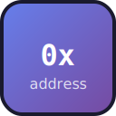

**Self-Custody Ethereum Wallet Extension**

[](https://opensource.org/licenses/MIT)
[](https://chrome.google.com/webstore)
[](https://developer.chrome.com/docs/extensions/mv3/)

[Website](https://0xaddress.com) • [GitHub](https://github.com/stamping/0xaddress) • [Playground](https://0xaddress.com/dev/)

</div>

---

## 📑 Tabla de Contenidos

1. [Introducción](#1-introducción)
2. [Arquitectura del Sistema](#2-arquitectura-del-sistema)
3. [Estructura del Proyecto](#3-estructura-del-proyecto)
4. [Componentes Principales](#4-componentes-principales)
5. [Flujos de Datos](#5-flujos-de-datos)
6. [Seguridad y Criptografía](#6-seguridad-y-criptografía)
7. [Integración con dApps](#7-integración-con-dapps)
8. [Gestión de Redes](#8-gestión-de-redes)
9. [Sistema de Almacenamiento](#9-sistema-de-almacenamiento)
10. [Internacionalización](#10-internacionalización)
11. [Guía de Desarrollo](#11-guía-de-desarrollo)
12. [API Reference](#12-api-reference)
13. [Troubleshooting](#13-troubleshooting)

---

## 1. Introducción

### 1.1 Descripción General

**0xAddress** es una extensión de navegador para Chrome que funciona como wallet Web3 de auto-custodia. Permite a los usuarios gestionar sus activos digitales, conectarse a aplicaciones descentralizadas (dApps) y firmar transacciones de forma segura.

### 1.2 Características Principales

| Característica | Descripción |
|----------------|-------------|
| **Auto-custodia** | Las claves privadas nunca salen del dispositivo del usuario |
| **Multi-red** | Soporte para 20+ redes EVM (Ethereum, Polygon, BSC, etc.) |
| **EIP-1193** | Provider compatible con el estándar Ethereum |
| **Tokens ERC-20** | Gestión completa de tokens fungibles |
| **NFTs ERC-721** | Visualización y transferencia de NFTs |
| **Firma segura** | Soporte para personal_sign y EIP-712 |
| **Certificados PEM** | Backup encriptado exportable |

### 1.3 Requisitos del Sistema

```
Chrome/Chromium >= 88
Manifest Version: 3
Node.js >= 18 (desarrollo)
```

### 1.4 Tecnologías Utilizadas

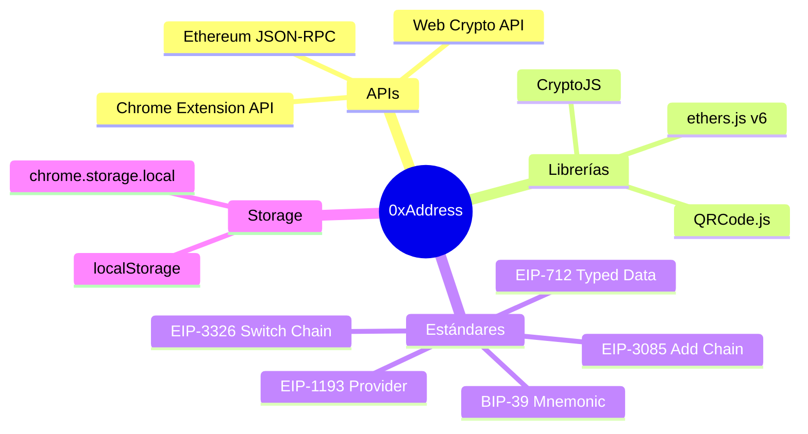

---

## 2. Arquitectura del Sistema

### 2.1 Visión General de la Arquitectura

La extensión sigue el patrón de arquitectura de Chrome Extensions con Manifest V3, dividiendo la funcionalidad en tres contextos aislados que se comunican mediante paso de mensajes.

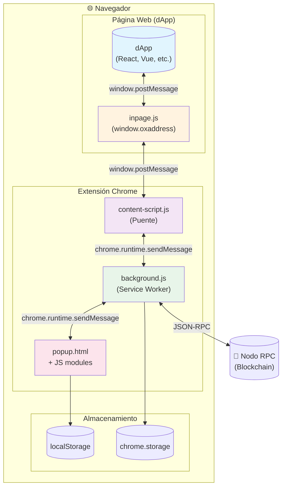

### 2.2 Contextos de Ejecución

| Contexto | Archivo(s) | Descripción | Acceso |
|----------|-----------|-------------|--------|
| **Page Context** | `inpage.js` | Provider inyectado en `window.oxaddress` | DOM, window |
| **Content Script** | `content-script.js` | Puente de comunicación | DOM limitado, chrome.runtime |
| **Service Worker** | `background.js` | Lógica central y estado | chrome.* APIs, fetch |
| **Popup** | `popup.html`, `app.js`, etc. | Interfaz de usuario | DOM propio, chrome.* APIs |

### 2.3 Diagrama de Componentes

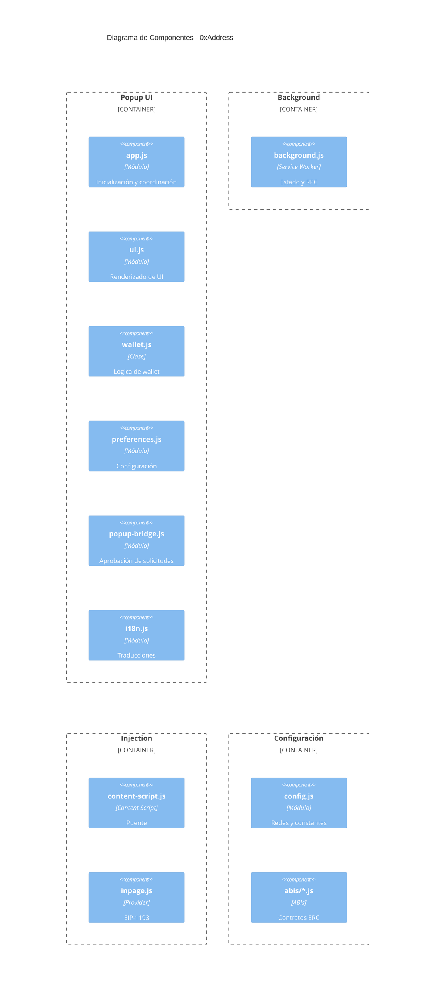

---

## 3. Estructura del Proyecto

### 3.1 Árbol de Directorios

```
0xaddress/
├── 📄 manifest.json          # Configuración de la extensión
├── 📄 popup.html             # HTML principal del popup
├── 📄 README.md              # Documentación básica
│
├── 📁 js/                    # Código JavaScript
│   ├── 📄 app.js             # Inicialización principal
│   ├── 📄 background.js      # Service Worker
│   ├── 📄 config.js          # Configuración de redes
│   ├── 📄 content-script.js  # Puente de comunicación
│   ├── 📄 event-handlers.js  # Manejadores de eventos UI
│   ├── 📄 i18n.js            # Sistema de traducciones
│   ├── 📄 inpage.js          # Provider inyectado
│   ├── 📄 multi-account.js   # Gestión multi-cuenta
│   ├── 📄 other-contracts.js # Contratos adicionales
│   ├── 📄 popup-bridge.js    # Aprobación de solicitudes
│   ├── 📄 preferences.js     # Panel de preferencias
│   ├── 📄 ui.js              # Componentes de UI
│   └── 📄 wallet.js          # Lógica core del wallet
│
├── 📁 css/
│   └── 📄 styles.css         # Estilos globales
│
├── 📁 lib/                   # Librerías externas
│   ├── 📄 ethers.min.js      # ethers.js v6
│   ├── 📄 crypto-js.min.js   # CryptoJS
│   └── 📄 qrcode.min.js      # Generador QR
│
├── 📁 abis/                  # ABIs de contratos
│   ├── 📄 erc20.js           # ABI ERC-20
│   └── 📄 erc721.js          # ABI ERC-721
│
├── 📁 icons/                 # Iconos de la extensión
│   ├── 📄 icon16.png
│   ├── 📄 icon32.png
│   ├── 📄 icon48.png
│   ├── 📄 icon128.png
│   └── 📄 icon.svg
│
└── 📁 demo/                  # Demos y ejemplos
    └── 📄 signature-lab.html
```

### 3.2 Descripción de Archivos Principales

| Archivo | Líneas | Tamaño | Responsabilidad |
|---------|--------|--------|-----------------|
| `background.js` | ~900 | 27KB | Estado global, RPC, sesiones, solicitudes pendientes |
| `wallet.js` | ~1200 | 49KB | Criptografía, firma, balances, transacciones |
| `ui.js` | ~3000 | 104KB | Renderizado, modales, listas, formularios |
| `popup-bridge.js` | ~1700 | 63KB | Aprobación de conexiones/transacciones |
| `i18n.js` | ~1600 | 69KB | Traducciones ES/EN |
| `app.js` | ~1100 | 44KB | Inicialización, navegación, eventos |
| `config.js` | ~400 | 12KB | Redes predefinidas, NetworkManager |
| `preferences.js` | ~600 | 24KB | Configuración, overlays, onboarding |
| `inpage.js` | ~270 | 8.5KB | Provider EIP-1193 inyectado |

---

## 4. Componentes Principales

### 4.1 Background Service Worker (`background.js`)

El Service Worker es el corazón de la extensión. Mantiene el estado global y procesa todas las solicitudes RPC.

#### 4.1.1 Estado Global

```javascript
let walletState = {
  isLocked: true,           // Estado de bloqueo
  address: null,            // Dirección activa
  chainId: '0x23a',         // Chain ID en hex (default: Rollux)
  connectedSites: {},       // Sitios conectados
  sessionKey: null,         // Llave privada en memoria
  sessionExpiry: null       // Timestamp de expiración
};
```

#### 4.1.2 Ciclo de Vida del Service Worker

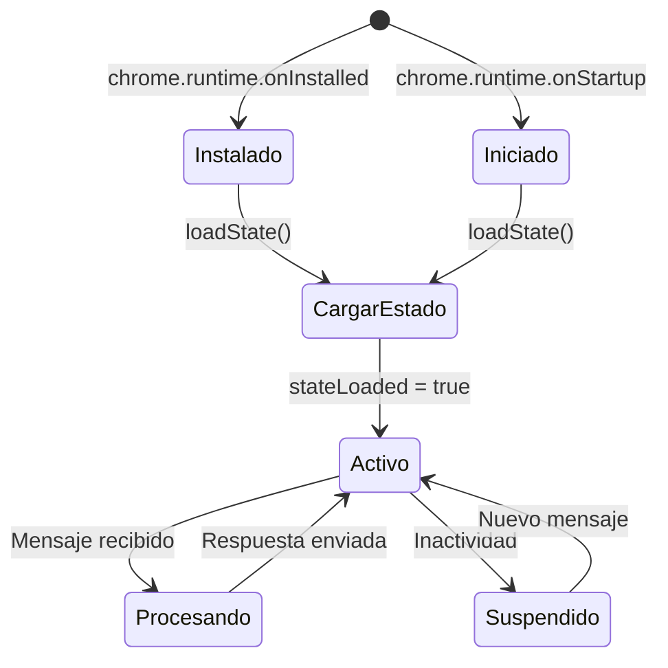

#### 4.1.3 Tipos de Mensajes Manejados

| Tipo de Mensaje | Descripción | Requiere Auth |
|-----------------|-------------|---------------|
| `GET_STATE` | Obtener estado público | No |
| `RPC_REQUEST` | Solicitud JSON-RPC | Variable |
| `POPUP_UNLOCK` | Desbloquear wallet | Sí |
| `POPUP_LOCK` | Bloquear wallet | No |
| `POPUP_APPROVE_REQUEST` | Aprobar solicitud | Sí |
| `POPUP_REJECT_REQUEST` | Rechazar solicitud | No |
| `POPUP_UPDATE_NETWORK` | Cambiar red | No |
| `POPUP_DISCONNECT_SITE` | Desconectar sitio | No |
| `POPUP_GET_PENDING` | Obtener solicitudes pendientes | No |
| `POPUP_EXECUTE_TX` | Ejecutar transacción | Sí |
| `POPUP_SIGN_MESSAGE` | Firmar mensaje | Sí |

### 4.2 Wallet Core (`wallet.js`)

Clase principal que maneja toda la lógica criptográfica y de blockchain.

#### 4.2.1 Estructura de la Clase Wallet

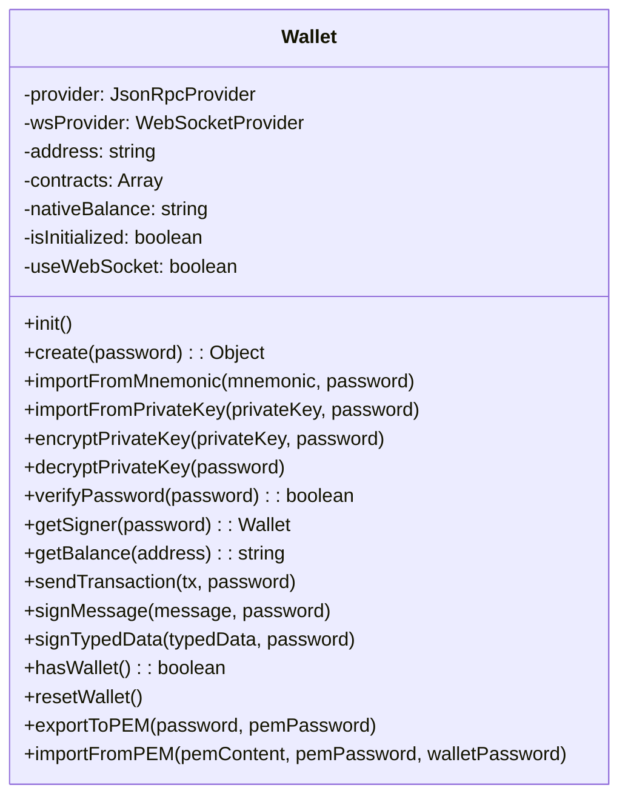

#### 4.2.2 Métodos de Encriptación

```javascript
// PBKDF2 + AES-256-CBC
encryptWithPBKDF2(data, password, iterations = 300000) {
    const salt = CryptoJS.lib.WordArray.random(128 / 8);
    const iv = CryptoJS.lib.WordArray.random(128 / 8);
    const key = CryptoJS.PBKDF2(password, salt, {
        keySize: 256 / 32,
        iterations: iterations,
        hasher: CryptoJS.algo.SHA256
    });
    
    const encrypted = CryptoJS.AES.encrypt(data, key, {
        iv: iv,
        mode: CryptoJS.mode.CBC,
        padding: CryptoJS.pad.Pkcs7
    });
    
    return { ct, iv, salt, iterations };
}
```

### 4.3 Provider Inyectado (`inpage.js`)

Provider compatible con EIP-1193 que se inyecta como `window.oxaddress`.

#### 4.3.1 Interfaz del Provider

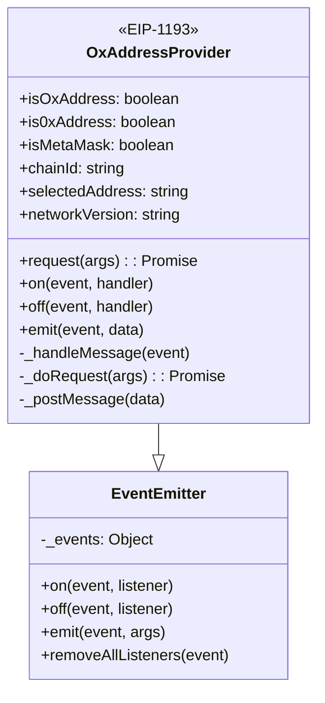

#### 4.3.2 Eventos Soportados

| Evento | Descripción | Payload |
|--------|-------------|---------|
| `connect` | Conexión establecida | `{ chainId: string }` |
| `disconnect` | Conexión perdida | `{ code: number, message: string }` |
| `chainChanged` | Cambio de red | `chainId: string` |
| `accountsChanged` | Cambio de cuenta | `accounts: string[]` |

### 4.4 Content Script (`content-script.js`)

Actúa como puente bidireccional entre la página web y el background.

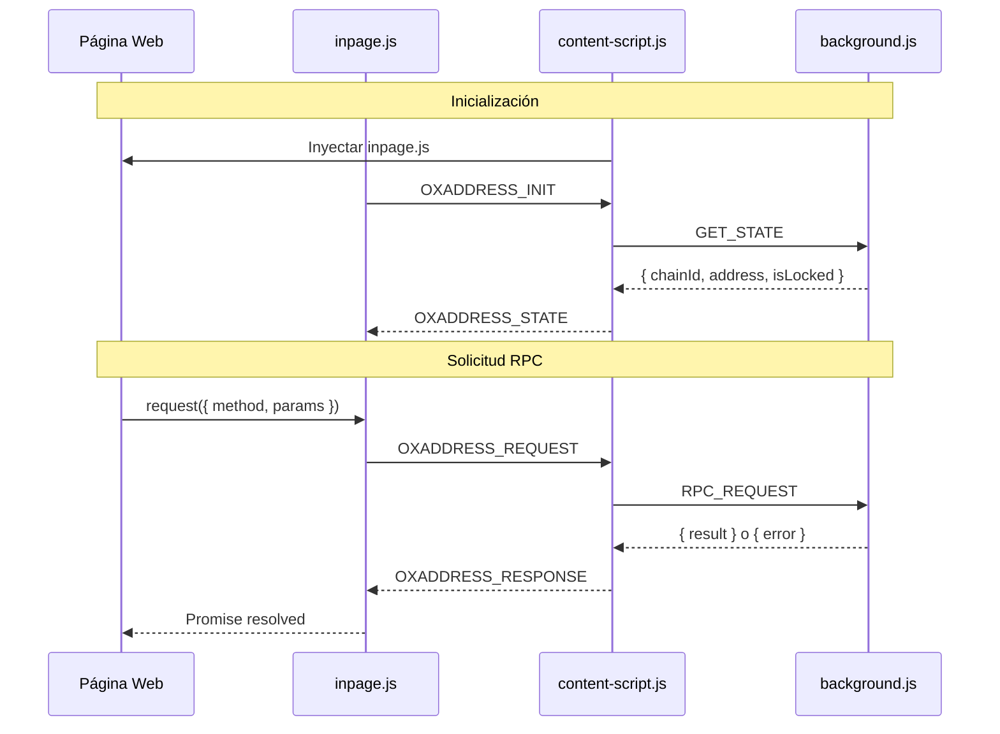

---

## 5. Flujos de Datos

### 5.1 Flujo de Conexión (eth_requestAccounts)

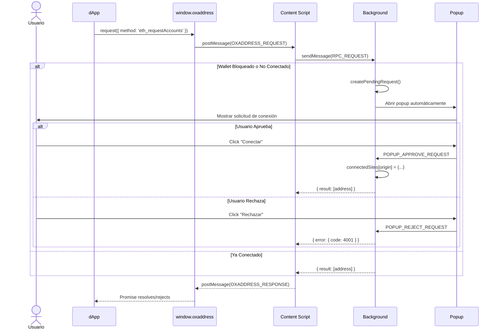

### 5.2 Flujo de Firma de Mensaje (personal_sign)

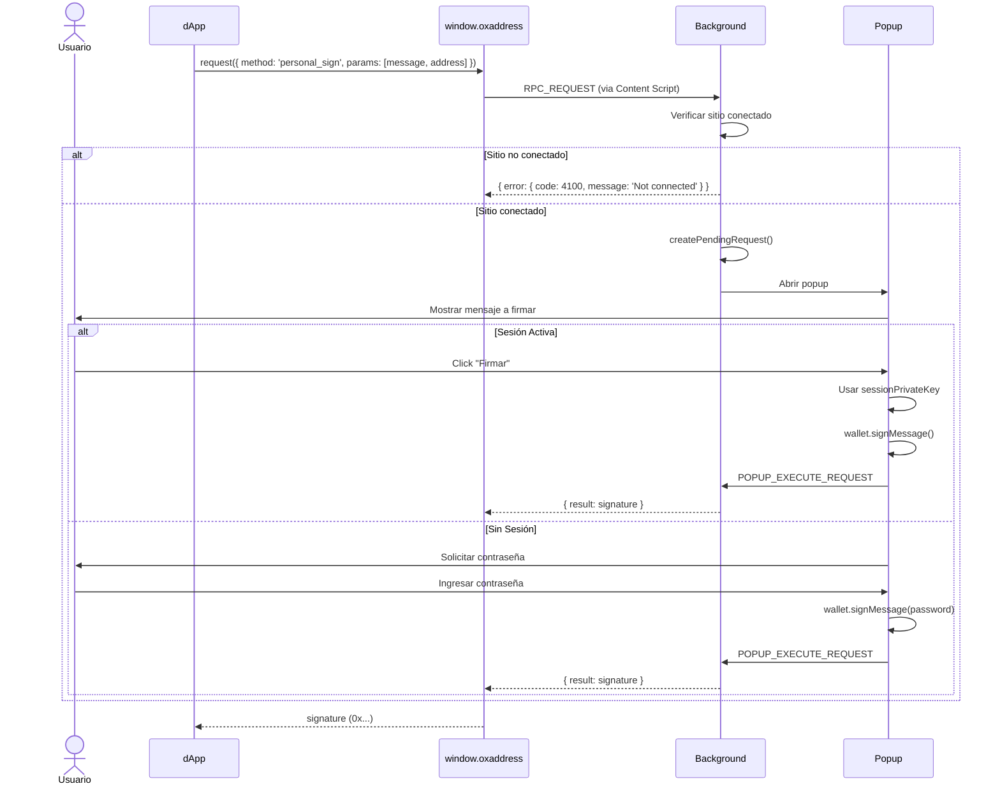

### 5.3 Flujo de Transacción (eth_sendTransaction)

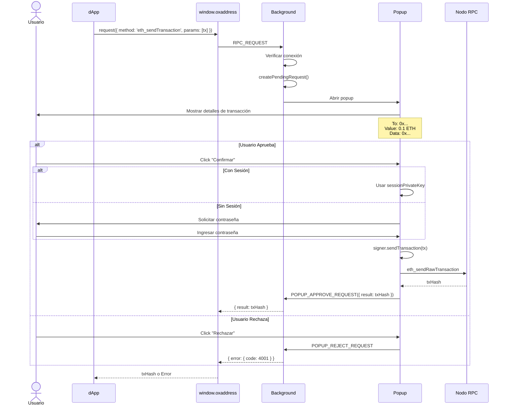

### 5.4 Flujo de Cambio de Red (wallet_switchEthereumChain)

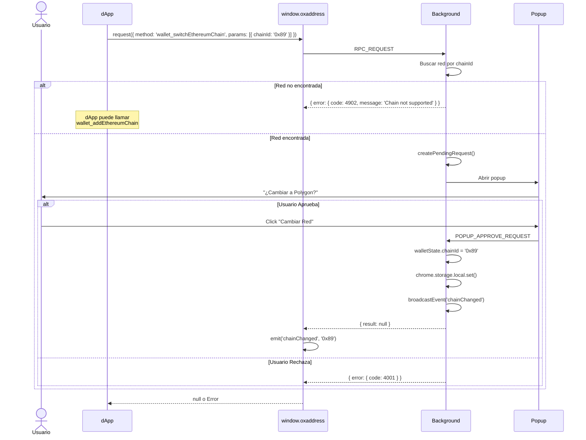

---

## 6. Seguridad y Criptografía

### 6.1 Modelo de Seguridad

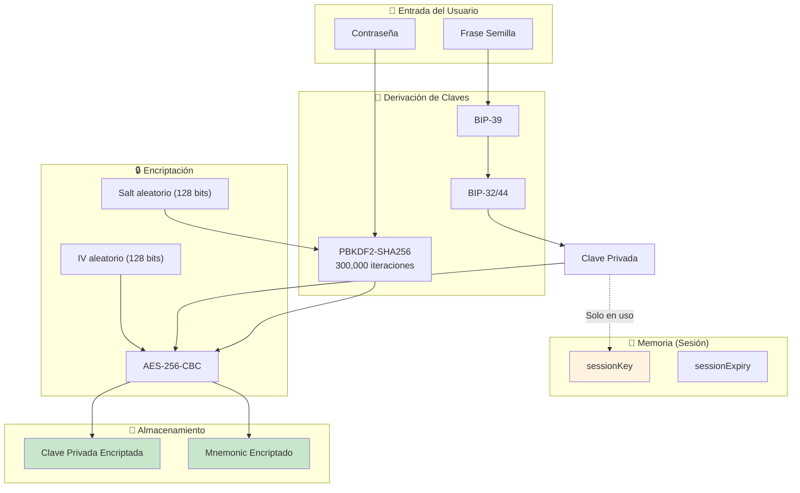

### 6.2 Algoritmos Criptográficos

| Propósito | Algoritmo | Parámetros |
|-----------|-----------|------------|
| Derivación de clave | PBKDF2 | SHA-256, 300,000 iteraciones |
| Encriptación simétrica | AES-256 | Modo CBC, PKCS7 padding |
| IV | Random | 128 bits |
| Salt | Random | 128 bits |
| Hash de direcciones | Keccak-256 | Estándar Ethereum |
| Firma ECDSA | secp256k1 | Estándar Ethereum |

### 6.3 Almacenamiento Seguro

#### 6.3.1 Formato de Clave Encriptada

```json
{
  "ct": "base64_encoded_ciphertext",
  "iv": "hex_encoded_iv",
  "salt": "hex_encoded_salt",
  "iterations": 300000
}
```

#### 6.3.2 Certificado PEM

```
-----BEGIN OXADDRESS ENCRYPTED WALLET-----
Version: 1.0
Address: 0x1234...abcd
Network: rollux
Timestamp: 2024-01-15T10:30:00Z
Iterations: 300000

eyJjdCI6IkJhc2U2NC4uLiIsIml2IjoiLi4uIiwic2FsdCI6Ii4uLiJ9
-----END OXADDRESS ENCRYPTED WALLET-----
```

### 6.4 Gestión de Sesiones

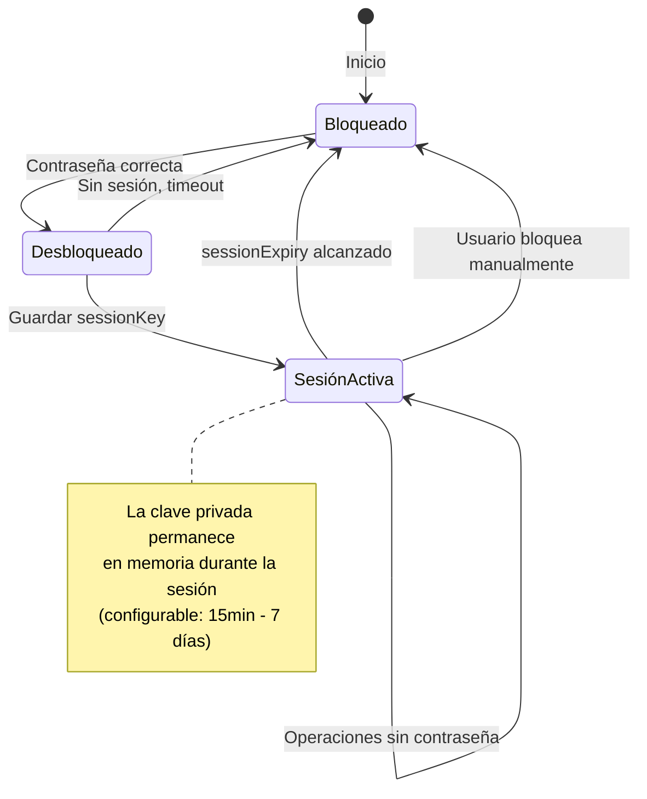

### 6.5 Principios de Seguridad

1. **Clave privada nunca en disco sin encriptar**
   - Siempre encriptada con AES-256-CBC
   - Solo desencriptada en memoria durante operaciones

2. **Aislamiento de contextos**
   - Content script no tiene acceso a claves
   - Background solo comparte información pública

3. **Validación de origen**
   - Cada solicitud incluye `origin` verificable
   - Sitios deben estar explícitamente conectados

4. **Sin dependencias externas para criptografía sensible**
   - PBKDF2 y AES via CryptoJS (auditado)
   - Firma via ethers.js (estándar de la industria)

---

## 7. Integración con dApps

### 7.1 Provider API (EIP-1193)

El provider se expone como `window.oxaddress` y es compatible con el estándar EIP-1193.

#### 7.1.1 Detección del Provider

```javascript
// Detectar 0xAddress
if (window.oxaddress) {
    console.log('0xAddress está instalado');
    const provider = window.oxaddress;
}

// Detección múltiple (0xAddress o MetaMask)
function getProvider() {
    if (window.oxaddress) return window.oxaddress;
    if (window.ethereum) return window.ethereum;
    return null;
}
```

#### 7.1.2 Métodos RPC Soportados

| Método | Categoría | Descripción |
|--------|-----------|-------------|
| `eth_requestAccounts` | Conexión | Solicitar conexión |
| `eth_accounts` | Conexión | Obtener cuentas conectadas |
| `eth_chainId` | Red | Obtener Chain ID |
| `net_version` | Red | Obtener versión de red |
| `personal_sign` | Firma | Firmar mensaje |
| `eth_sign` | Firma | Firmar hash (legacy) |
| `eth_signTypedData_v4` | Firma | Firma EIP-712 |
| `eth_sendTransaction` | Transacción | Enviar transacción |
| `eth_call` | Lectura | Llamar función de contrato |
| `eth_getBalance` | Lectura | Obtener balance |
| `eth_getTransactionReceipt` | Lectura | Obtener recibo |
| `eth_blockNumber` | Lectura | Número de bloque actual |
| `eth_gasPrice` | Lectura | Precio de gas |
| `eth_estimateGas` | Lectura | Estimar gas |
| `wallet_switchEthereumChain` | Red | Cambiar de red |
| `wallet_addEthereumChain` | Red | Agregar nueva red |

### 7.2 Ejemplos de Integración

#### 7.2.1 Conexión Básica

```javascript
async function connectWallet() {
    if (!window.oxaddress) {
        alert('Por favor instala 0xAddress');
        return;
    }
    
    try {
        const accounts = await window.oxaddress.request({
            method: 'eth_requestAccounts'
        });
        
        console.log('Conectado:', accounts[0]);
        return accounts[0];
    } catch (error) {
        if (error.code === 4001) {
            console.log('Usuario rechazó la conexión');
        }
        throw error;
    }
}
```

#### 7.2.2 Firma de Mensaje

```javascript
async function signMessage(message) {
    const accounts = await window.oxaddress.request({
        method: 'eth_accounts'
    });
    
    if (!accounts.length) {
        throw new Error('No conectado');
    }
    
    const signature = await window.oxaddress.request({
        method: 'personal_sign',
        params: [message, accounts[0]]
    });
    
    return signature;
}
```

#### 7.2.3 Firma EIP-712 (Typed Data)

```javascript
async function signPermit(tokenAddress, spender, value, deadline) {
    const accounts = await window.oxaddress.request({
        method: 'eth_accounts'
    });
    
    const chainId = await window.oxaddress.request({
        method: 'eth_chainId'
    });
    
    const typedData = {
        types: {
            EIP712Domain: [
                { name: 'name', type: 'string' },
                { name: 'version', type: 'string' },
                { name: 'chainId', type: 'uint256' },
                { name: 'verifyingContract', type: 'address' }
            ],
            Permit: [
                { name: 'owner', type: 'address' },
                { name: 'spender', type: 'address' },
                { name: 'value', type: 'uint256' },
                { name: 'nonce', type: 'uint256' },
                { name: 'deadline', type: 'uint256' }
            ]
        },
        primaryType: 'Permit',
        domain: {
            name: 'Token Name',
            version: '1',
            chainId: parseInt(chainId, 16),
            verifyingContract: tokenAddress
        },
        message: {
            owner: accounts[0],
            spender: spender,
            value: value,
            nonce: 0,
            deadline: deadline
        }
    };
    
    const signature = await window.oxaddress.request({
        method: 'eth_signTypedData_v4',
        params: [accounts[0], JSON.stringify(typedData)]
    });
    
    return signature;
}
```

#### 7.2.4 Envío de Transacción

```javascript
async function sendTransaction(to, valueInEth) {
    const accounts = await window.oxaddress.request({
        method: 'eth_accounts'
    });
    
    const valueWei = '0x' + (BigInt(valueInEth * 1e18)).toString(16);
    
    const txHash = await window.oxaddress.request({
        method: 'eth_sendTransaction',
        params: [{
            from: accounts[0],
            to: to,
            value: valueWei
        }]
    });
    
    return txHash;
}
```

#### 7.2.5 Cambio de Red

```javascript
async function switchToPolygon() {
    try {
        await window.oxaddress.request({
            method: 'wallet_switchEthereumChain',
            params: [{ chainId: '0x89' }] // 137 en hex
        });
    } catch (error) {
        if (error.code === 4902) {
            // Red no existe, intentar agregarla
            await window.oxaddress.request({
                method: 'wallet_addEthereumChain',
                params: [{
                    chainId: '0x89',
                    chainName: 'Polygon Mainnet',
                    nativeCurrency: {
                        name: 'MATIC',
                        symbol: 'MATIC',
                        decimals: 18
                    },
                    rpcUrls: ['https://polygon-rpc.com'],
                    blockExplorerUrls: ['https://polygonscan.com']
                }]
            });
        }
    }
}
```

#### 7.2.6 Escuchar Eventos

```javascript
// Cambio de cuenta
window.oxaddress.on('accountsChanged', (accounts) => {
    if (accounts.length === 0) {
        console.log('Desconectado');
    } else {
        console.log('Nueva cuenta:', accounts[0]);
    }
});

// Cambio de red
window.oxaddress.on('chainChanged', (chainId) => {
    console.log('Nueva red:', chainId);
    // Recomendado: recargar la página
    window.location.reload();
});

// Conexión establecida
window.oxaddress.on('connect', (info) => {
    console.log('Conectado a:', info.chainId);
});

// Desconexión
window.oxaddress.on('disconnect', (error) => {
    console.log('Desconectado:', error.message);
});
```

### 7.3 Playground de Desarrollo

Para probar integraciones, utiliza el playground oficial:

**URL**: https://0xaddress.com/dev/

El playground permite:
- Probar todos los métodos RPC
- Ver código de ejemplo en JS
- Descargar demos HTML funcionales
- Generar código compatible con MetaMask

---

## 8. Gestión de Redes

### 8.1 Redes Predefinidas

0xAddress incluye soporte nativo para las siguientes redes:

| Red | Chain ID | Símbolo | RPC Principal |
|-----|----------|---------|---------------|
| Rollux | 570 | SYS | https://rpc.rollux.com |
| Syscoin NEVM | 57 | SYS | https://rpc.syscoin.org |
| Ethereum | 1 | ETH | https://eth.llamarpc.com |
| Polygon | 137 | POL | https://polygon-rpc.com |
| BNB Smart Chain | 56 | BNB | https://bsc-dataseed.binance.org |
| Arbitrum One | 42161 | ETH | https://arb1.arbitrum.io/rpc |
| Optimism | 10 | ETH | https://mainnet.optimism.io |
| Base | 8453 | ETH | https://mainnet.base.org |
| Avalanche | 43114 | AVAX | https://api.avax.network/ext/bc/C/rpc |
| Fantom | 250 | FTM | https://rpc.ftm.tools |
| Cronos | 25 | CRO | https://evm.cronos.org |
| Linea | 59144 | ETH | https://rpc.linea.build |
| zkSync Era | 324 | ETH | https://mainnet.era.zksync.io |
| Mantle | 5000 | MNT | https://rpc.mantle.xyz |
| Celo | 42220 | CELO | https://forno.celo.org |
| Gnosis | 100 | xDAI | https://rpc.gnosischain.com |
| Scroll | 534352 | ETH | https://rpc.scroll.io |
| Blast | 81457 | ETH | https://rpc.blast.io |
| Soneium | 1868 | ETH | https://rpc.soneium.org |
| Sepolia | 11155111 | ETH | https://rpc.sepolia.org |

### 8.2 NetworkManager

El `NetworkManager` (en `config.js`) gestiona las redes disponibles.

```javascript
const NetworkManager = {
    // Obtener red actual
    getCurrentNetwork() {
        const saved = localStorage.getItem('0xaddress_network');
        return this.getNetwork(saved) || NETWORKS.rollux;
    },
    
    // Cambiar red activa
    setCurrentNetwork(networkId) {
        const network = this.getNetwork(networkId);
        if (network) {
            localStorage.setItem('0xaddress_network', networkId);
            return network;
        }
        return null;
    },
    
    // Obtener todas las redes
    getAllNetworks() {
        const networks = { ...NETWORKS };
        const custom = this.getCustomNetworks();
        return { ...networks, ...custom };
    },
    
    // Agregar red personalizada
    addCustomNetwork(network) {
        const customNetworks = this.getCustomNetworks();
        const id = `custom_${network.chainId}`;
        customNetworks[id] = { ...network, id, isCustom: true };
        localStorage.setItem('0xaddress_custom_networks', 
            JSON.stringify(customNetworks));
        return id;
    }
};
```

### 8.3 Estructura de Red

```typescript
interface Network {
    id: string;           // Identificador único
    name: string;         // Nombre para mostrar
    chainId: number;      // Chain ID decimal
    rpcUrl: string;       // RPC principal
    rpcUrlFallback?: string; // RPC de respaldo
    wsUrl?: string;       // WebSocket URL
    wsUrlFallback?: string;
    explorer: string;     // URL del explorador
    currency: {
        name: string;     // Nombre de la moneda
        symbol: string;   // Símbolo (ETH, BNB, etc.)
        decimals: number; // Decimales (generalmente 18)
    };
    isDefault?: boolean;  // Red por defecto
    isCustom?: boolean;   // Red agregada por usuario
}
```

---

## 9. Sistema de Almacenamiento

### 9.1 Claves de Almacenamiento

0xAddress utiliza dos mecanismos de almacenamiento:

#### 9.1.1 localStorage (Datos del Popup)

| Clave | Tipo | Descripción |
|-------|------|-------------|
| `0xaddress_encrypted_key` | JSON | Clave privada encriptada |
| `0xaddress_address` | string | Dirección del wallet |
| `0xaddress_mnemonic` | JSON | Mnemonic encriptado |
| `0xaddress_network` | string | ID de red activa |
| `0xaddress_contracts` | JSON | Tokens agregados |
| `0xaddress_nfts` | JSON | NFTs agregados |
| `0xaddress_custom_networks` | JSON | Redes personalizadas |
| `0xaddress_activity` | JSON | Historial de actividad |
| `0xaddress_language` | string | Idioma seleccionado |
| `0xaddress_session_expiry` | number | Timestamp de expiración |
| `0xaddress_session_duration` | number | Duración de sesión (ms) |

#### 9.1.2 chrome.storage.local (Background)

| Clave | Tipo | Descripción |
|-------|------|-------------|
| `0xaddress_address` | string | Dirección (sincronizado) |
| `0xaddress_network` | string | ID de red |
| `0xaddress_chainId` | string | Chain ID en hex |
| `0xaddress_connected_sites` | JSON | Sitios conectados |
| `0xaddress_session_key` | string | Clave de sesión |
| `0xaddress_session_expiry` | number | Expiración de sesión |
| `0xaddress_custom_networks` | JSON | Redes personalizadas |

### 9.2 Diagrama de Almacenamiento

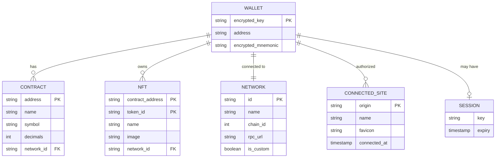

---

## 10. Internacionalización

### 10.1 Sistema i18n

El archivo `i18n.js` contiene todas las traducciones organizadas por idioma.

```javascript
const translations = {
    es: {
        // General
        appName: '0xAddress',
        loading: 'Cargando...',
        cancel: 'Cancelar',
        confirm: 'Confirmar',
        // ... más traducciones
    },
    en: {
        appName: '0xAddress',
        loading: 'Loading...',
        cancel: 'Cancel',
        confirm: 'Confirm',
        // ... more translations
    }
};
```

### 10.2 Uso de Traducciones

```javascript
// Función de traducción
function t(key) {
    const lang = localStorage.getItem('0xaddress_language') || 'es';
    return translations[lang][key] || translations['es'][key] || key;
}

// Uso en código
document.getElementById('title').textContent = t('welcome');

// Uso en HTML con data attributes
<span data-i18n="welcome"></span>

// Aplicar traducciones a elementos con data-i18n
function applyTranslations() {
    document.querySelectorAll('[data-i18n]').forEach(el => {
        const key = el.getAttribute('data-i18n');
        el.textContent = t(key);
    });
}
```

### 10.3 Idiomas Soportados

| Código | Idioma | Cobertura |
|--------|--------|-----------|
| `es` | Español | 100% |
| `en` | English | 100% |

---

## 11. Guía de Desarrollo

### 11.1 Configuración del Entorno

```bash
# Clonar repositorio
git clone https://github.com/stamping/0xaddress.git
cd 0xaddress

# No requiere instalación de dependencias
# Las librerías están incluidas en /lib

# Cargar en Chrome
1. Abrir chrome://extensions
2. Activar "Modo de desarrollador"
3. Click en "Cargar descomprimida"
4. Seleccionar la carpeta del proyecto
```

### 11.2 Estructura de Desarrollo

```
Desarrollo Local
├── Editar archivos JS/CSS/HTML
├── Recargar extensión en chrome://extensions
└── Probar cambios en el popup o en dApps

Debugging
├── Popup: Click derecho → Inspeccionar
├── Background: chrome://extensions → Service Worker
├── Content Script: DevTools de la página → Console
└── Inpage: DevTools de la página → Console (window.oxaddress)
```

### 11.3 Convenciones de Código

#### Nomenclatura

```javascript
// Variables: camelCase
let userAddress = '0x...';

// Constantes: UPPER_SNAKE_CASE
const MAX_RETRIES = 3;

// Clases: PascalCase
class WalletProvider { }

// Funciones: camelCase, verbos descriptivos
function getUserBalance() { }
async function sendTransaction() { }

// Eventos: camelCase con prefijo 'on' o 'handle'
function onAccountChange() { }
function handleNetworkSwitch() { }
```

#### Estructura de Funciones

```javascript
/**
 * Descripción de la función
 * @param {string} address - Dirección del wallet
 * @param {number} chainId - ID de la red
 * @returns {Promise<string>} Balance en wei
 */
async function getBalance(address, chainId) {
    // Validación de entrada
    if (!ethers.isAddress(address)) {
        throw new Error('Invalid address');
    }
    
    // Lógica principal
    try {
        const balance = await provider.getBalance(address);
        return balance.toString();
    } catch (error) {
        console.error('Error getting balance:', error);
        throw error;
    }
}
```

### 11.4 Testing Manual

#### Checklist de Pruebas

- [ ] Crear nuevo wallet
- [ ] Importar wallet desde mnemonic
- [ ] Importar wallet desde archivo PEM
- [ ] Conectar a dApp
- [ ] Firmar mensaje (personal_sign)
- [ ] Firmar typed data (EIP-712)
- [ ] Enviar transacción
- [ ] Cambiar de red
- [ ] Agregar red personalizada
- [ ] Agregar token ERC-20
- [ ] Ver NFTs
- [ ] Exportar certificado PEM
- [ ] Bloquear/Desbloquear wallet
- [ ] Cambiar contraseña
- [ ] Resetear wallet

### 11.5 Agregar Nueva Red

```javascript
// En config.js, agregar al objeto NETWORKS:
newNetwork: {
    id: 'newNetwork',
    name: 'New Network',
    chainId: 12345,
    rpcUrl: 'https://rpc.newnetwork.com',
    rpcUrlFallback: 'https://backup.newnetwork.com',
    explorer: 'https://explorer.newnetwork.com',
    currency: {
        name: 'Token Name',
        symbol: 'TKN',
        decimals: 18
    }
},

// En background.js, agregar a getRpcUrl():
12345: 'https://rpc.newnetwork.com',

// En background.js, agregar a getChainIdHex():
newNetwork: '0x3039',

// En background.js, agregar a findNetworkByChainId():
12345: 'newNetwork',

// En background.js, agregar a getNetworkName():
newNetwork: 'New Network',
```

### 11.6 Agregar Nueva Traducción

```javascript
// En i18n.js, agregar la clave en ambos idiomas:

// Español
es: {
    // ... existing translations
    newFeature: 'Nueva característica',
    newFeatureDesc: 'Descripción de la nueva característica',
}

// English
en: {
    // ... existing translations
    newFeature: 'New Feature',
    newFeatureDesc: 'Description of the new feature',
}

// Uso en código:
document.getElementById('feature').textContent = t('newFeature');
```

---

## 12. API Reference

### 12.1 Clase Wallet

```typescript
class Wallet {
    // Propiedades
    provider: ethers.JsonRpcProvider;
    address: string | null;
    nativeBalance: string;
    isInitialized: boolean;
    
    // Inicialización
    async init(): Promise<void>;
    
    // Creación e importación
    create(password: string): { address: string, mnemonic: string };
    importFromMnemonic(mnemonic: string, password: string): { address: string };
    importFromPrivateKey(privateKey: string, password: string): { address: string };
    importFromPEM(pemContent: string, pemPassword: string, walletPassword: string): { address: string };
    
    // Criptografía
    encryptPrivateKey(privateKey: string, password: string): EncryptedData;
    decryptPrivateKey(password: string): string;
    verifyPassword(password: string): boolean;
    getMnemonic(password: string): string | null;
    
    // Operaciones
    getSigner(password: string): ethers.Wallet;
    async getBalance(address?: string): Promise<string>;
    async sendTransaction(tx: TransactionRequest, password: string): Promise<string>;
    async signMessage(message: string, password: string): Promise<string>;
    async signTypedData(domain: object, types: object, value: object, password: string): Promise<string>;
    
    // Tokens
    async getTokenBalance(tokenAddress: string, walletAddress: string): Promise<string>;
    async getTokenInfo(tokenAddress: string): Promise<TokenInfo>;
    async transferToken(tokenAddress: string, to: string, amount: string, password: string): Promise<string>;
    
    // Estado
    hasWallet(): boolean;
    hasMnemonic(): boolean;
    resetWallet(): void;
    
    // Exportación
    async exportToPEM(password: string, pemPassword: string): Promise<string>;
}

interface EncryptedData {
    ct: string;      // Ciphertext en Base64
    iv: string;      // IV en hex
    salt: string;    // Salt en hex
    iterations: number;
}

interface TokenInfo {
    address: string;
    name: string;
    symbol: string;
    decimals: number;
}
```

### 12.2 Provider (window.oxaddress)

```typescript
interface OxAddressProvider {
    // Propiedades
    readonly isOxAddress: boolean;
    readonly is0xAddress: boolean;
    readonly isMetaMask: false;
    readonly chainId: string | null;
    readonly selectedAddress: string | null;
    readonly networkVersion: string | null;
    
    // Método principal
    request(args: RequestArguments): Promise<unknown>;
    
    // Eventos
    on(event: string, handler: Function): this;
    off(event: string, handler: Function): this;
    removeAllListeners(event?: string): this;
}

interface RequestArguments {
    method: string;
    params?: unknown[];
}

// Eventos disponibles
type ProviderEvents = 
    | 'connect'
    | 'disconnect'
    | 'chainChanged'
    | 'accountsChanged';
```

### 12.3 Códigos de Error

| Código | Nombre | Descripción |
|--------|--------|-------------|
| 4001 | User Rejected | Usuario rechazó la solicitud |
| 4100 | Unauthorized | No conectado al sitio |
| 4200 | Unsupported | Método no soportado |
| 4900 | Disconnected | Provider desconectado |
| 4901 | Chain Disconnected | Red desconectada |
| 4902 | Unrecognized Chain | Red no reconocida |
| -32600 | Invalid Request | Solicitud inválida |
| -32601 | Method Not Found | Método no encontrado |
| -32602 | Invalid Params | Parámetros inválidos |
| -32603 | Internal Error | Error interno |
| -32700 | Parse Error | Error de parsing JSON |

---

## 13. Troubleshooting

### 13.1 Problemas Comunes

#### El provider no se detecta

```javascript
// Problema: window.oxaddress es undefined

// Solución 1: Esperar a que se inyecte
window.addEventListener('load', () => {
    setTimeout(() => {
        if (window.oxaddress) {
            // Provider disponible
        }
    }, 100);
});

// Solución 2: Escuchar evento personalizado
window.addEventListener('oxaddress#initialized', () => {
    console.log('0xAddress ready');
});
```

#### Error al firmar transacción

```javascript
// Problema: "Fondos insuficientes"
// Verificar balance antes de enviar
const balance = await window.oxaddress.request({
    method: 'eth_getBalance',
    params: [address, 'latest']
});

const balanceEth = parseInt(balance, 16) / 1e18;
console.log('Balance:', balanceEth, 'ETH');
```

#### Red no cambia después de switch

```javascript
// Problema: chainChanged no se emite

// Solución: Recargar estado después del cambio
window.oxaddress.on('chainChanged', (chainId) => {
    // Recargar página para actualizar estado
    window.location.reload();
});
```

### 13.2 Logs de Debug

```javascript
// Habilitar logs en el Service Worker
// chrome://extensions → 0xAddress → Service Worker

// Logs importantes:
// 🚀 0xAddress installed - Extensión instalada
// 🔄 0xAddress started - Service Worker iniciado
// 📦 State loaded - Estado cargado
// 🔗 RPC: [method] from [origin] - Solicitud RPC recibida
// 🌐 RPC call: [method] - Llamada RPC enviada
// ✅ Approving: [id] - Solicitud aprobada
// ❌ Rejecting: [id] - Solicitud rechazada
```

### 13.3 Resetear Estado

```javascript
// En la consola del popup (Inspeccionar)
localStorage.clear();

// En la consola del Service Worker
chrome.storage.local.clear();

// Luego recargar la extensión
```

---

## Apéndices

### A. Glosario

| Término | Definición |
|---------|------------|
| **ABI** | Application Binary Interface - Interfaz para interactuar con contratos |
| **BIP-39** | Estándar para frases mnemotécnicas |
| **BIP-44** | Estándar para derivación de claves HD |
| **Chain ID** | Identificador único de una red blockchain |
| **dApp** | Aplicación descentralizada |
| **EIP** | Ethereum Improvement Proposal |
| **ERC-20** | Estándar para tokens fungibles |
| **ERC-721** | Estándar para tokens no fungibles (NFTs) |
| **Gas** | Unidad de cómputo en Ethereum |
| **HD Wallet** | Hierarchical Deterministic Wallet |
| **JSON-RPC** | Protocolo de comunicación con nodos |
| **Mnemonic** | Frase de recuperación de 12/24 palabras |
| **PBKDF2** | Password-Based Key Derivation Function 2 |
| **Provider** | Interfaz de comunicación con la blockchain |
| **RPC** | Remote Procedure Call |
| **Wei** | Unidad mínima de ETH (1 ETH = 10^18 Wei) |

### B. Referencias

- [EIP-1193: Ethereum Provider JavaScript API](https://eips.ethereum.org/EIPS/eip-1193)
- [EIP-712: Typed structured data hashing and signing](https://eips.ethereum.org/EIPS/eip-712)
- [EIP-3326: Wallet Switch Ethereum Chain](https://eips.ethereum.org/EIPS/eip-3326)
- [EIP-3085: Wallet Add Ethereum Chain](https://eips.ethereum.org/EIPS/eip-3085)
- [BIP-39: Mnemonic code for generating deterministic keys](https://github.com/bitcoin/bips/blob/master/bip-0039.mediawiki)
- [Chrome Extension Manifest V3](https://developer.chrome.com/docs/extensions/mv3/)
- [ethers.js Documentation](https://docs.ethers.org/v6/)

### C. Changelog

#### v1.0.0 (Dic, 2025)
- Lanzamiento inicial
- Soporte para 20+ redes EVM
- Firma personal_sign y EIP-712
- Gestión de tokens ERC-20 y NFTs
- Certificados PEM encriptados
- Internacionalización ES/EN

---

<div align="center">

**0xAddress Wallet**

Documentación Técnica v1.0

[Website](https://0xaddress.com) • [GitHub](https://github.com/stamping/0xaddress) • [Playground](https://0xaddress.com/dev/)

© 2025 Stamping.io - MIT License

</div>
